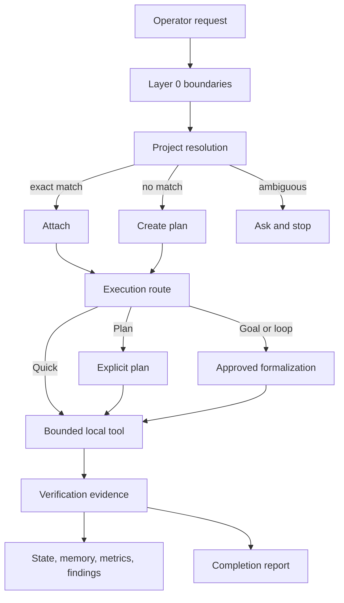

# PlzDo Local

[](https://github.com/taljeon/plzdo/actions/workflows/verify.yml)
[](LICENSE)

PlzDo Local is a local-first control plane for AI-assisted engineering. It adds deterministic project routing, bounded durable work, explicit authority, and evidence-backed completion without adding a model provider, daemon, scheduler, telemetry client, or package downloader.

It is not an AI model, editor, deployment system, or operating-system sandbox. It gives an existing coding agent and repository a compact working contract.

## Quick Start

Requirements: macOS or Linux, Python 3.9 or newer, Git 2.30 or newer, and Bash 3.2 or newer.

```bash
git clone https://github.com/taljeon/plzdo.git
cd plzdo
./scripts/verify
./bin/plzdo doctor
./bin/plzdo --help
```

Use the checked-in `./bin/plzdo` wrapper from a reviewed checkout. PlzDo does not provide a prefix installer, edit shell startup files, or create a global launcher.

Durable state resolves in this order:

1. `PLZDO_HOME`
2. `$XDG_STATE_HOME/plzdo-local`
3. `~/.local/state/plzdo-local`

Inspect the selected path without writing:

```bash
./bin/plzdo state-root status --json
```

## What It Does

| Surface | Purpose |
| --- | --- |
| Project control | Catalog and registry validation, exact attach/create/ask resolution, and Quick/Plan/Goal routing |
| Project frame | Deterministic planning and validation for `AGENTS.md`, task, requirements, design, checks, and verification files |
| Durable work | Approved formalizations, compact/full context packs, bounded state, checkpoints, and tracking-only loops |
| Evidence | Sanitized local memory, append-preserving findings, and bounded run metrics |
| Local operations | Read-only repository preflight, manual snapshots, and sanitized review prepare/validate/import |
| Managed resources | Repository-owned public skill and agent installation with marker-bound repair and uninstall |
| Reference catalogs | Local source and design catalog search without live network access |
| Real apply | A separate, default-disabled P5 path for one fixed managed project frame under an operator-enabled policy |

Examples:

```bash
./bin/plzdo route "Review this bounded refactor" --json
./bin/plzdo sources list --json
./bin/plzdo design search accessibility --json
./bin/plzdo skills list --json
./bin/plzdo agents list --json
```

`init`, `new`, and `render --dry-run` only plan target bytes. `render --write` remains intentionally unsupported. The focused P5 entry point re-renders bundled templates itself and accepts no arbitrary command or caller-supplied output set. See [Real Apply](docs/real-apply.md).

## Architecture



The runtime separates three concerns:

1. A compact policy kernel in `AGENTS.md`, `TASKS/current.md`, and `CHECKS.md`.
2. A dependency-free local control plane under `plzdo_local/`.
3. Executable evidence in schemas, negative tests, release scans, and exact hashes.

See [Architecture](docs/architecture.md) for the module and trust-boundary map.

## Local-Only Boundary

Checked-in PlzDo commands use local files and explicitly bounded local subprocesses. They do not call model providers, browsers, remote APIs, package managers, mail systems, schedulers, daemons, hooks, or telemetry endpoints.

`plzdo review prepare` creates a sanitized local bundle; `validate` checks it; `import` records an already-local answer as advisory evidence. PlzDo never sends the bundle. Manual upload or copy is an operator-owned egress event.

A hosted coding agent still uses its own vendor for inference. PlzDo's local-only claim is about the shipped control-plane commands, not the surrounding agent or an OS firewall. See [Local-Only Boundary](docs/local-only-boundary.md) and [Data and Privacy](docs/data-and-privacy.md).

## Managed Skills And Agents

The repository includes four small public skills and five agent role files. List them before installing:

```bash
./bin/plzdo skills list --json
./bin/plzdo agents list --json
```

Installation is explicit and network-free. It copies reviewed repository bytes to an explicit root or the local Codex resource root. Dry-run is available:

```bash
./bin/plzdo skills install ponytail --dry-run
./bin/plzdo agents install code-reviewer --dry-run
```

Managed markers bind the exact inventory. Repair only applies to marker-trusted drift, and uninstall removes only bytes that still match the recorded snapshot.

## Verification

Run the integrated gate:

```bash
./scripts/verify
```

It covers contracts, command lifecycles, routing, durable state, P5 refusal and rollback paths, managed resources, local review and monitoring, privacy scanning, release inventory, and negative fixtures. Tests use temporary synthetic data and no provider credentials.

Before publishing a Git checkout, use an external private denylist whose values never enter the repository or scanner output:

```bash
./scripts/check-publication \
  --private-denylist /absolute/path/to/private-denylist.json
```

The publication gate scans the bounded history reachable from `HEAD`, requires every local ref target to remain in that history, and inspects raw commit metadata, ref names, annotated tag objects, tree paths, and unique blobs. `SHA256SUMS` binds the current release tree.

## Design Principles

- Keep authority explicit and proportional to risk.
- Prefer progressive disclosure over loading every rule into every prompt.
- Treat memory, metrics, delegated work, and external review as non-authoritative inputs.
- Use schemas for structure and runtime validators for stricter semantic contracts.
- Make high-risk paths fail closed and cover refusal, interruption, drift, and rollback.
- Do not automate irreversible or external effects by default.

See [What Not to Automate](docs/what-not-to-automate.md).

## Documentation

- [Architecture](docs/architecture.md)
- [Command Reference](docs/command-reference.md)
- [State and Memory](docs/state-and-memory.md)
- [Real Apply](docs/real-apply.md)
- [Data and Privacy](docs/data-and-privacy.md)
- [Portability](docs/portability.md)
- [Checks](CHECKS.md)
- [Security Policy](SECURITY.md)

## License

MIT. See [LICENSE](LICENSE).
