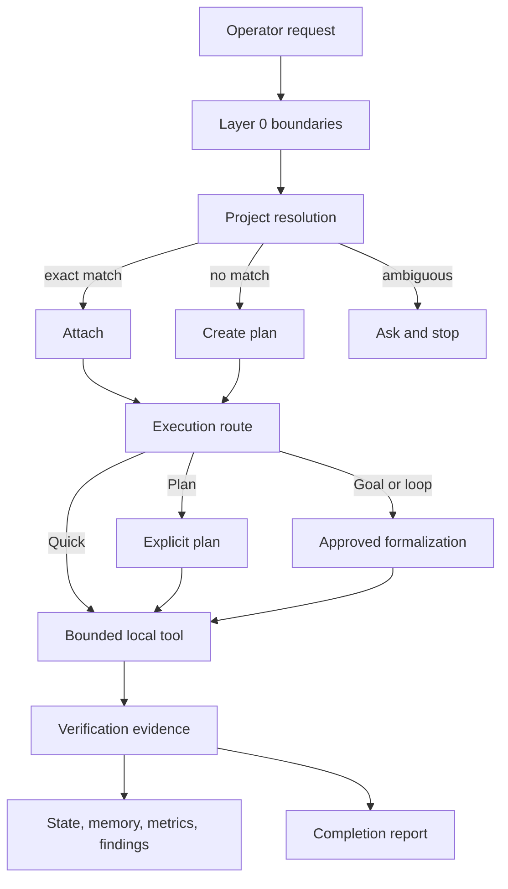

# PlzDo Local

PlzDo's core is a local control plane for AI-assisted engineering. It adds deterministic project routing, bounded durable work, explicit authority, and evidence-backed completion. The default `plzdo` distribution contains this provider-free core and its read-only parent adapter; local model execution belongs to the separately selected runtime.

This source preview updates the harness only. It requires no local LLM or cloud
provider account. Local-model runtime and external AI integrations are deferred
and are not included in this repository. For internal use, obtain the source
through an organization-approved channel and follow that organization's policy.

It is not an AI model, editor, deployment system, or operating-system sandbox. It gives an existing coding agent and repository a compact working contract.

## Quick Start

Core requirements: macOS or Linux, Python 3.9 or newer, Git 2.30 or newer, and Bash 3.2 or newer.

The optional parent adapter requires Python 3.11+ for its verifier and configured
core subprocess. The integrated verification harness uses Python 3.11+.
Explicit `--release-matrix` and exact-commit `--acceptance` verification also
require Python 3.9 for the core compatibility lane.

```bash
git clone https://github.com/taljeon/plzdo.git
cd plzdo
./scripts/verify
./bin/plzdo doctor
./bin/plzdo --help
```

The clone is the only network-dependent step in this example. After obtaining a
reviewed checkout through an approved source, setup, verification, state, and
managed-resource installation run locally without package downloads or hosted
services. See [Restricted Environment Setup](docs/restricted-environment.md).

Use the checked-in `./bin/plzdo` wrapper from a reviewed checkout. The 0.3.0
source also defines a `plzdo` distribution containing core and parent adapter.
The `local` extra is reserved for a matching runtime release; it is not part of
this source preview. The core has no runtime dependency or execution dispatch. See the
[package and isolated launcher contract](docs/core-adapter-packaging.md).

Durable state resolves in this order:

1. `PLZDO_HOME`
2. `$XDG_STATE_HOME/plzdo-local`
3. `~/.local/state/plzdo-local`

Inspect the selected path without writing:

```bash
./bin/plzdo state-root status --json
```

## What It Does

| Surface | Purpose |
| --- | --- |
| Project control | Catalog and registry validation, exact attach/create/ask resolution, and Quick/Plan/Goal routing |
| Project frame | Deterministic planning and validation for `AGENTS.md`, task, requirements, design, checks, and verification files |
| Durable work | Approved formalizations, compact/full context packs, bounded state, checkpoints, and tracking-only loops |
| Evidence | Sanitized local memory, append-preserving findings, and bounded run metrics |
| Local operations | Read-only repository preflight, manual snapshots, and sanitized review prepare/validate/import |
| Managed resources | Repository-owned public skill and agent installation with marker-bound repair and uninstall |
| Reference catalogs | Local source and design catalog search without live network access |
| Real apply | A separate, default-disabled P5 path for one fixed managed project frame under an operator-enabled policy |

Examples:

```bash
./bin/plzdo route "Review this bounded refactor" --json
./bin/plzdo sources list --json
./bin/plzdo design search accessibility --json
./bin/plzdo skills list --json
./bin/plzdo agents list --json
```

`init`, `new`, and `render --dry-run` only plan target bytes. `render --write` remains intentionally unsupported. The focused P5 entry point re-renders bundled templates itself and accepts no arbitrary command or caller-supplied output set. See [Real Apply](docs/real-apply.md).

## Architecture


```mermaid
flowchart TD
    A["Operator request"] --> B["Layer 0 boundaries"]
    B --> C["Project resolution"]
    C -->|"exact match"| D["Attach"]
    C -->|"no match"| E["Create plan"]
    C -->|"ambiguous"| F["Ask and stop"]
    D --> G["Execution route"]
    E --> G
    G -->|"Quick"| H["Bounded local tool"]
    G -->|"Plan"| I["Explicit plan"]
    G -->|"Goal or loop"| J["Approved formalization"]
    I --> H
    J --> H
    H --> K["Verification evidence"]
    K --> L["State, memory, metrics, findings"]
    K --> M["Completion report"]
```

The core separates three concerns:

1. A compact policy kernel in `AGENTS.md`, `TASKS/current.md`, and `CHECKS.md`.
2. A dependency-free local control plane under `plzdo_local/`.
3. Executable evidence in schemas, negative tests, release scans, and exact hashes.

See [Architecture](docs/architecture.md) for the module and trust-boundary map.

## Local-Only Boundary

The `plzdo` core commands use local files and explicitly bounded local subprocesses. They do not call model providers, browsers, remote APIs, package managers, mail systems, schedulers, daemons, hooks, or telemetry endpoints. The parent adapter runs only the fixed read-only core status commands.

`plzdo review prepare` creates a sanitized local bundle; `validate` checks it; `import` records an already-local answer as advisory evidence. PlzDo never sends the bundle. Manual upload or copy is an operator-owned egress event.

Local-model generation and external AI integration are separate optional work.
They are not published by this harness update and are not needed for its commands.
This source preview makes no claim about live model execution or OS isolation.

A hosted coding agent still uses its own vendor for inference. The core's local-only claim does not describe an OS firewall or the surrounding agent. See [Local-Only Boundary](docs/local-only-boundary.md) and [Data and Privacy](docs/data-and-privacy.md).

No hosted CI, external AI reviewer, or remote validation service is required to
accept a change. A Git push or pull request is an explicit code-transfer event
and should target only a repository approved for that code. Authors and
reviewers run the same checked-in local gate against the exact commit under
review.

## Managed Skills And Agents

The repository includes four small public skills and five agent role files. List them before installing:

```bash
./bin/plzdo skills list --json
./bin/plzdo agents list --json
```

Installation is explicit and network-free. It copies reviewed repository bytes to an explicit root or the local Codex resource root. Dry-run is available:

```bash
./bin/plzdo skills install ponytail --dry-run
./bin/plzdo agents install code-reviewer --dry-run
```

Managed markers bind the exact inventory. Repair only applies to marker-trusted drift, and uninstall removes only bytes that still match the recorded snapshot.

## Verification

Run the integrated gate:

```bash
./scripts/verify
```

The core gate covers contracts, command lifecycles, routing, durable state, P5 refusal and rollback paths, managed resources, the v2 parent adapter, staged installation, local review and monitoring, privacy scanning, release inventory, and negative fixtures. Tests use temporary synthetic data and no provider credentials. The optional runtime has separate component and distribution checks.

For collaboration, record the exact commit and local gate result in the pull
request. A reviewer should check out that commit and run
`./scripts/verify --acceptance <full-commit-sha>` locally. The acceptance mode
rejects staged, unstaged, untracked, and mismatched-HEAD states.
Remote status checks may be added by a downstream repository under its own
policy, but they are not part of PlzDo Local's acceptance contract.

Before publishing a Git checkout, use an external private denylist whose values never enter the repository or scanner output:

```bash
./scripts/check-publication \
  --private-denylist /absolute/path/to/private-denylist.json
```

The publication gate scans the bounded history reachable from `HEAD`, requires every local ref target to remain in that history, and inspects raw commit metadata, ref names, annotated tag objects, tree paths, and unique blobs. `SHA256SUMS` binds the current release tree.

## Design Principles

- Keep authority explicit and proportional to risk.
- Prefer progressive disclosure over loading every rule into every prompt.
- Treat memory, metrics, delegated work, and external review as non-authoritative inputs.
- Use schemas for structure and runtime validators for stricter semantic contracts.
- Make high-risk paths fail closed and cover refusal, interruption, drift, and rollback.
- Do not automate irreversible or external effects by default.

See [What Not to Automate](docs/what-not-to-automate.md).

## Documentation

- [Architecture](docs/architecture.md)
- [Command Reference](docs/command-reference.md)
- [State and Memory](docs/state-and-memory.md)
- [Real Apply](docs/real-apply.md)
- [Data and Privacy](docs/data-and-privacy.md)
- [Portability](docs/portability.md)
- [Restricted Environment Setup](docs/restricted-environment.md)
- [Contributing](CONTRIBUTING.md)
- [Checks](CHECKS.md)
- [Security Policy](SECURITY.md)

## License

The original core retains its existing MIT notice in [LICENSE](LICENSE). Models,
provider tools and the deferred runtime/integration projects are not included
or licensed by this repository.
