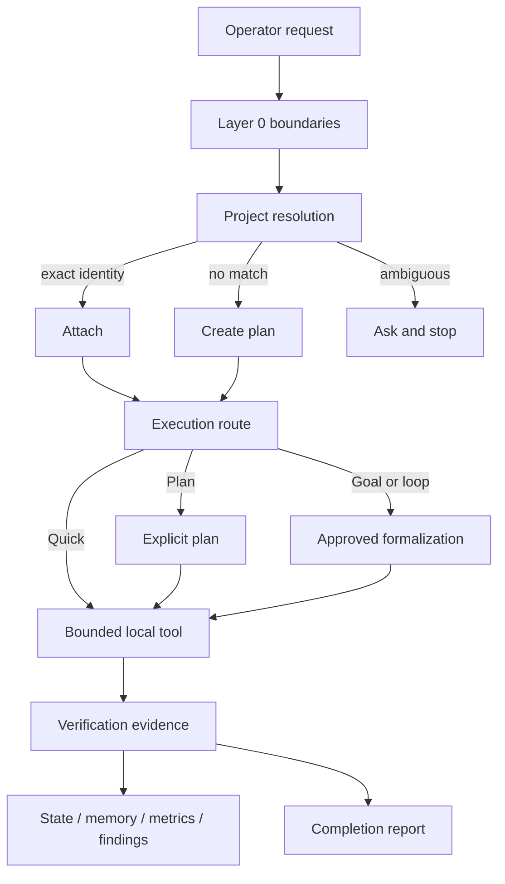

# Architecture

PlzDo Local is a local-first control plane for AI-assisted engineering. It does not replace the coding agent, editor, test runner, or Git. It gives those tools a small policy kernel, deterministic project identity, bounded durable state, and evidence-oriented completion rules.

## Control Flow



The runtime is intentionally split into three layers:

1. **Policy kernel:** root `AGENTS.md`, `TASKS/current.md`, and `CHECKS.md`. Each attached project owns its project-specific requirements and technical design; those files are product source of truth, not reusable global policy.
2. **Local control plane:** catalog, registry, route selection, formalization, context, state, memory, findings, metrics, monitoring, review preparation, and managed resources.
3. **Evidence layer:** executable checks, exact hashes, typed reports, rollback artifacts, and release scans.

## Module Map

| Module | Responsibility | Persistent writes |
| --- | --- | --- |
| `catalog.py` | Repository policy and apply eligibility | None by itself |
| `registry.py` | User project identity and deterministic resolution | Registry document |
| `execution_rules.py` | Quick, Plan, Goal, and bounded-loop classification | None |
| `renderer.py` | Exact in-memory project-frame rendering | None |
| `formalization.py` | Draft, approval, completion, and supersession lifecycle | Formalization documents |
| `context.py` | Compact and full context packs from a fixed source set | Context pack |
| `state.py` | Bounded recovery state and archive-first compaction | State and archives |
| `local_memory.py` | Sanitized, local, non-authoritative reusable notes | Local memory store |
| `findings.py` | Append-preserving finding decisions | Findings ledger |
| `metrics.py` | Bounded retrospective run metadata | Metrics records |
| `monitor.py` | Manual read-only repository observations | Snapshot only |
| `review_bundle.py` | Local sanitized review preparation and response import | Advisory artifacts |
| `managed_install.py` | Exact managed copies of bundled skills and role files | Explicit destination only |
| `apply_gate.py` | Default-disabled exact target mutation and recovery | Approved target and evidence state |

The command layer is deliberately thin. `cli.py` routes core commands, while the durable, resource, local-operations, and apply command modules translate CLI input into validated library calls. They do not carry independent policy.

## Authority

| Input | Authority |
| --- | --- |
| Layer 0 safety and privacy rules | Hard boundary |
| Latest operator request | Highest task intent below Layer 0 |
| Current task and approved formalization | Active work contract |
| Attached-project requirements and technical design | Product intent for that project |
| Code and tests | Implementation facts |
| Catalog and registry | Project identity and apply policy |
| Context, state, memory, metrics, monitoring | Non-authoritative support data |
| Worker or imported review output | Advisory data only |

If policy text and implementation disagree, the disagreement is a blocker. A summary never overrides newer source or tests.

## Project Identity

Resolution is deterministic:

```text
exact id or alias -> attach
else exact domain and area -> attach
else multiple matches -> ask and stop
else -> produce a creation plan
```

Archived projects do not auto-attach. Catalog policy and the user registry remain separate so a local work area cannot silently redefine repository policy.

## Durable State

All durable documents use explicit schema versions, exact-key validation where authority is involved, deterministic JSON, bounded size, atomic replacement, and writer locks. Project-local state lives under `.plzdo/`; user-level state follows `PLZDO_HOME`, then XDG state, then the platform-neutral home fallback documented in [portability.md](portability.md).

State and memory are recovery aids, not source of truth. Compaction is archive-first. Findings use durable IDs and explicit terminal decisions. Metrics are retrospective signals, never permissions.

### Storage layout

The default user-level root is resolved in this order:

1. `PLZDO_HOME`;
2. `$XDG_STATE_HOME/plzdo-local`;
3. `~/.local/state/plzdo-local`.

Project-local managed files remain inside the project. User-level records stay under the resolved state root. Commands expose the resolved location through `plzdo state-root status`; callers should not infer it.

### Write discipline

Durable writers follow the same sequence:

1. validate input and the current document;
2. acquire a bounded writer lock;
3. revalidate relevant identity or freshness;
4. write a temporary regular file with bounded bytes;
5. flush and atomically replace;
6. return typed evidence.

Symlinks, special files, duplicate JSON keys, unknown fields on authority-bearing documents, and out-of-root paths fail closed.

## High-Risk Writes

Default commands inspect, render in memory, or write PlzDo-owned state. Mutating another repository is a separate P5 path with a plan, operator-enabled catalog policy, clean Git identity, exact source and target fingerprints, typed confirmation, atomic file replacement, byte verification, and rollback evidence. See [real-apply.md](real-apply.md).

P5 is not a general command runner. Its output set is fixed to the managed project frame, and its rollback data is evidence for those exact bytes only. A failed prerequisite produces a typed refusal rather than a best-effort write.

## External Review

PlzDo Local can prepare a sanitized, byte-bounded local review bundle and import a local response. It has no provider adapter and no send command. Imported responses remain advisory, non-instructional, and without tool authority.

The preparation path records both source and sanitized hashes so later review can distinguish source drift from redaction. A bundle is never proof that its contents are safe to upload; the operator still owns the final disclosure decision.

## Failure Semantics

- **Ask:** required operator input is missing or project identity is ambiguous.
- **Blocked:** a policy, authority, integrity, or safety prerequisite is not satisfied.
- **Deferred:** a bounded recoverable availability or freshness prerequisite is pending.
- **Failed:** an attempted operation did not complete; evidence records whether any rollback occurred.
- **Complete:** declared checks and output evidence agree with the frozen work contract.

No support document can upgrade one terminal state into another. Retry requires a new invocation against current state.

## Deliberate Omissions

There is no daemon, scheduler, watcher, hook installer, telemetry client, browser automation, provider login, package downloader, auto-update path, or Obsidian integration. These omissions are product boundaries, not unfinished defaults.
